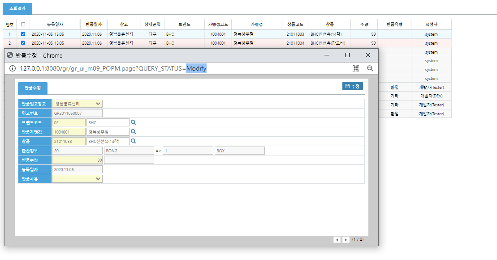
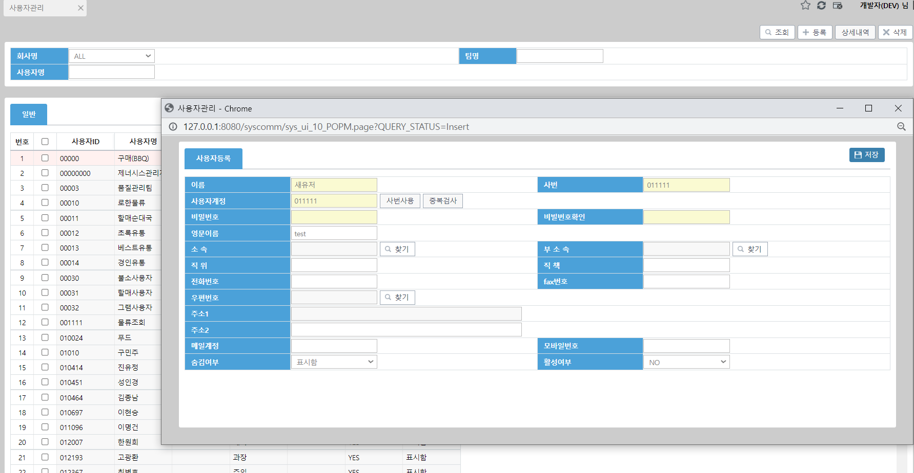
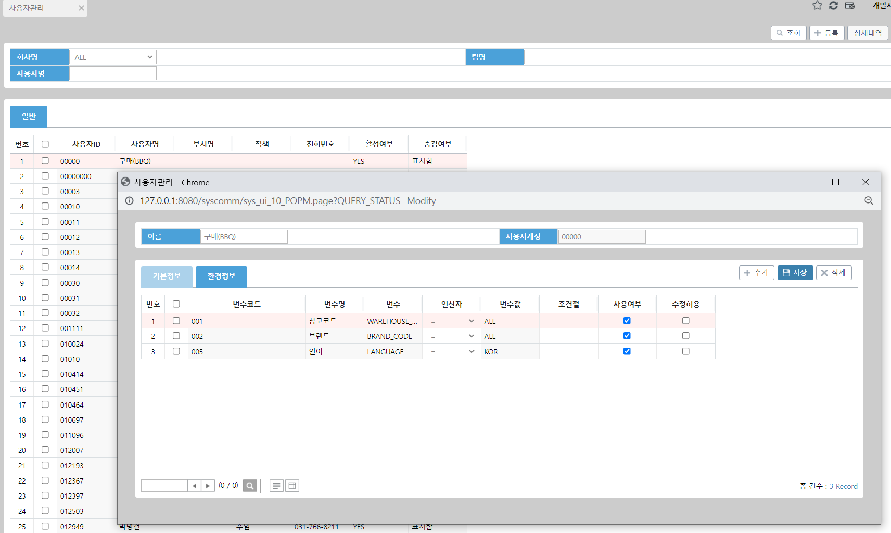
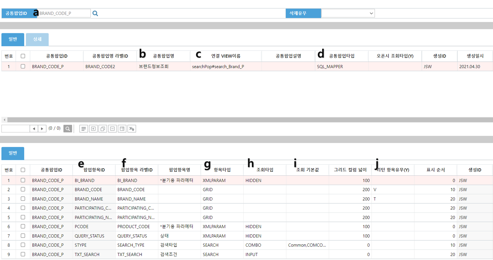
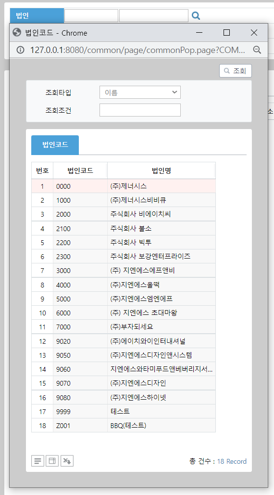

# BLIS2.0 : 모듈 메뉴얼

## ***CONTEXT*** **(목차)**

> ## **Server-side**
>
>> - ## [Session](#sessionsec)
>>      - [Session Interceptor](#sessioninter)
>>      - [Login](#login)
>> - ## [Web Scrapping](#webscrap)
>>      - [설정](#config)
>>      - [스케줄러 Annotation](#webscrap)
>> - ## [커스텀 예외 처리](#customerror)
>>      - [class PasswordExpiryException](#pwd_exp)
>>      - [class WmsPolicyException](#wms_policy)

> ## **Client-side**
>
>> - ## [head.jsp](#headinclude)
>>      - [구조](#structheadjsp)
>> - ## [searchArea와 dataBind](#sa_db)
>>      - [구조](#stuctsadb)
>>      - [사용 예시](#inpdatabindex)
>> - ## [NetUtil](#netutiljs)
>>      - [사용 예시](#netutilex)
>> - ## [Grid](#gridbox)
>>      - [구조](#stuctgrid)
>>      - [callback 함수](#cbgrid)
>>      - [dataViewer.js](#dataviewer)

> ## **HOW-TO**
>
>> - ## [Create User](#new_user)
>>      - [구조 및 생성](#stuct_user)
>>      - [환경변수 설정](#user_env)
>> - ## [Create Menu](#menu)
>>      - [구조 및 생성](#stuct_menu)
>> - ## [Create Combo](#combo)
>>      - [구조 및 생성](#stuct_c)
>>      - [callback 함수](#callback_combo)
>> - ## [Create searchHelp](#sh)
>>      - [구조 및 생성](#stuct_grid_sh)
>>      - [callback 함수](#callback_sh)
>>      - [팝업 driven VS 이벤트 driven)](#p_vs_ed)

> ## **커스텀 스크립트 API**
>
>> - ## [_COMMONBLIS](#commonblisjs)
>> - ## [override](#overridejs)

<br/><br/>

**<h1 id="sessionsec">Session</h1>**
> <h3 id="sessioninter">Session Interceptor</h3>

서버를 통하는 모든 HTTP요청은 *commonIntercepter*, *sessionIntercepter*, *fileIntercepter* 순으로 필터링 된다. 그 중 *sessionIntercepter*는 클라이언트 session의 로그인 여부에 따라 요청 데이터 및 page를 리턴, 우회, 혹은 exception으로 처리 한다. 

```java
    //로그인 상태 여부를 userId 속성으로 확인
    String sesUserId = (String)request.getSession().getAttribute(CommonConfig.SES_USER_ID_KEY);

    //로그인 상태 X
    if (sesUserId == null || sesUserId.equals("")) {
            //로그인 여부와 상관없는 URI 관리
			if (    ...
					|| uriInfo.getUri().indexOf("pop") != -1 
                    || uriInfo.getUri().indexOf("login") != -1
					|| uriInfo.getUri().indexOf("index") != -1
                ){
                    ..
             }else{
                //로그인 사용자외 요청 시 예외처리 
                throw new SessionEmptyException();
             }
	} 
    //로그인 상태 O
    else {
        ...
        userEnvInfo = (DataMap) request.getSession().getAttribute("user_infor");
        pwdExpStatus = (String) request.getSession().getAttribute("expire_password");
        //패스워드 유효기간 만료 exception
        if (uriInfo.getExt().equals("page")) {
            if (pwdExpStatus != null && pwdExpStatus.equals("Y")
                    && new DataMap(request).containsKey(CommonConfig.MENU_ID_KEY)) {
                throw new PasswordExpiryException();
            }
        }
    }

```
*sessionIntercepter*의 기본 클라이언트 요청 prehandling 역활외에 다른 특히사항은 session객체의 있는 user정보 등에 attribute값 들을 DataMap에 바인딩해 타겟 handler method(컨트롤러)로 패싱한다는 것이다.  

```java
{
    //sessionIntercepter
    ...
	    if (uriInfo.getExt().equals("page")) {
				if (pwdExpStatus != null && pwdExpStatus.equals("Y")
						&& new DataMap(request).containsKey(CommonConfig.MENU_ID_KEY)) {
					throw new PasswordExpiryException();
				}
			}
		}

		log.info(CommonConfig.SES_USER_ID_KEY + " : " + sesUserId);

		params.put(CommonConfig.SES_USER_TYPE_KEY, userType);
		params.put(CommonConfig.SES_USER_ID_KEY, sesUserId);
		params.put(CommonConfig.SES_USER_COMPANY_KEY, sesCompky);
		params.put(CommonConfig.SES_USER_LANGUAGE_KEY, sesLang);
		params.put(CommonConfig.SES_USER_INFO_KEY, userInfo);
		params.put(CommonConfig.SES_USER_IP_KEY, request.getRemoteAddr());
		params.put(CommonConfig.SES_USER_WHAREHOUSE_KEY, sesWareky);
		params.put(CommonConfig.SES_USER_WHAREHOUSE_NM_KEY, sesWarenm);
		params.put("REP_BRAND_CODE", userEnvInfo.getString("BRAND_CODE"));
		params.put(CommonConfig.SES_USER_EMPL_ID_KEY, sesUserExpId);
		params.put(CommonConfig.SES_SCHEMA, sesSchema);

		request.setAttribute(CommonConfig.PARAM_ATT_KEY, params);
}
```
```java

//commonController
@RequestMapping("/common/{module}/json/{command}.*")
public String count(HttpServletRequest request, @PathVariable String module, @PathVariable String command, Map model) throws SQLException {
    //sessionIntercepter에서 바인딩된 객체를 꺼내 사용 할 수 있다
    DataMap map = (DataMap) request.getAttribute(CommonConfig.PARAM_ATT_KEY);
    
    map.setModuleCommand(module, command);
    String result = commonService.getMap(map);
    model.put("data", result);

    return JSON_VIEW;
}

```
<br></br>
> <h3 id="login">Login</h3>

*/index2.jsp*는 BLIS2.0의 기본 landing페이지 이며 해당 화면은 사용자의 로그인, 로그아웃, 세션 타임아웃시 리턴되는 화면이다. 로그인 요청시 유저 validation 절차는 다음과 같다.

```java
@RequestMapping("/common/json/login.*")
	public String login(HttpSession session, HttpServletRequest request, Map model) throws Exception {
        User user = (User) commonDao.getObj(map);

        if(!user){
            return;
        }
		...
        //유저 존재 확인 후
        new UserSessionAttributeBuilder(session, user, commonDao).setUserPwdExpiry(map)
                                                                 //비밀번호 만료여부 확인
                                                                 .setUserEnvVariable(map)
                                                                 //유저 환경변수 세팅
                                                                 .setUserMenu(map)
                                                                 //유저 메뉴리스트 세팅
                                                                 .setUserSysVariable(map);
                                                                 //유저 테마,언어등 시스템 변수 세팅 

        ...
		return JSON_VIEW;
	}
```
*UserSessionAttributeBuilder* 클래스는 향후 로그인 절차 수정 및 변경시 간단하게 해당 method를 분리 하거나 부착 할 수 있다. 각 method에서 클라이언트 세션 객체에 세팅하는 attribute 값들은 로그아웃시 제거된다. 

```java
@RequestMapping("/common/json/logout.*")
	public String logout(HttpSession session, HttpServletRequest request, Map model) throws SQLException {
        ...
        session.removeAttribute(CommonConfig.SES_USER_OBJECT_KEY);
        session.removeAttribute(CommonConfig.SES_USER_ID_KEY);
        session.removeAttribute(CommonConfig.SES_USER_NAME_KEY);
        session.removeAttribute(CommonConfig.SES_USER_COMPANY_KEY);
        session.removeAttribute(CommonConfig.SES_DEPT_ID_KEY);
        session.removeAttribute(CommonConfig.SES_USER_INFO_KEY);
        session.removeAttribute(CommonConfig.SES_USER_MENU_KEY);
        ...
		
	}
```

<br/><br/>

**<h1 id="webscrap">Web Scrapping</h1>**
><h3 id="config">설정</h3>

*Jsoup* 라이브러리와 *Spring Scheduler* API를 사용하여 웹 스크래핑 서비스 메소드를 재호출 하였다. *@Scheduled* annotation을 사용해 *cron* 변수에 값을 넣어 메소드 호출 시간을 설정 할 수 있다. 

```java
package project.common.task;

@Service
public class WebScrapperScheduled{

    //**@Scheduled(cron = " 초 |분|시|일|월|요일|연도-생략가능")**
    @Scheduled(cron = "0 0 11 * * MON-SAT")
    private void scrapPoultryInfo() throws IOException, SQLException {

        DataMap map = ScrapPoultryOrKr.getTodayPrice();
        ...
    }
}
```

```java
package project.common.webScrapper;

public class ScrapPoultryOrKr {

	private static final String _HOSTURL = "https://www.poultry.or.kr/";
	private static final String _THEAD_SELECTOR = ".market-price .price-area table.t_price thead";
	private static final String _TBODY_ROW_SELECTOR = ".market-price .price-area table.t_price tbody tr";

	public static DataMap getTodayPrice() throws IOException, SQLException {
        ...
		// --------------------------------------------------------------
        try {
            Document doc = Jsoup.connect(_HOSTURL).get();
            Elements thead = doc.select(_THEAD_SELECTOR);
            Elements trs = doc.select(_TBODY_ROW_SELECTOR);

        }
        ...

}
```
유지보수 관련 권장 사항은 *WebScrapperScheduled* 서비스와 특정 웹사이트에서 html을 스크래핑하는 프로세스를 구분관리하여 스크래핑 자체의 로직은 다른 서비스에서도 동일하게 사용하는 것이다.
<br></br>
**<h1 id="customerror">커스텀 예외 처리</h1>**
서버 예외 발생시 각 exception 타입을 핸들링 하는 설정은 servlet-common.xml에서 찾아 볼 수 있다.
```xml
<!-- servlet-common.xml -->
<?xml version="1.0" encoding="UTF-8"?>
    ...
	<bean
		class="org.springframework.web.servlet.handler.SimpleMappingExceptionResolver">
		<property name="exceptionMappings">
			<props>
				<prop key="project.common.exception.SessionEmptyException">
					sessionEmpty
				</prop>
				<prop key="project.common.exception.PasswordExpiryException">
					passwordExpiry
				</prop>
				<prop key="project.common.exception.WMSPolicyException">
					policyViolation
				</prop>
				<prop key="java.lang.Exception">
					dataException
				</prop>
			</props>
		</property>
		<property name="exceptionAttribute" value="exceptionMsg" />
	</bean>
</beans>
```

<br></br>
> <h3 id="pwd_exp">class PasswordExpiryException</h3>

유저 로그인시 비밀번호 만료일이 지났을때 발생되는 exception이며 *passwordExpiry.jsp* 페이지를 리턴한다.

```jsp
<%@ page language="java" contentType="text/html; charset=UTF-8"
    pageEncoding="UTF-8"%>
<!DOCTYPE html>
<html>

<head>
    <meta charset="UTF-8">
    <title>Password Expired</title>
    window.top.location.href = "/webdek/main_tree.page";
    </script>
</head>

</html>
```

<br></br>
> <h3 id="wms_policy">class WmsPolicyException</h3>

설계 정책에 반한 예외 발생시 invoke되는 exception이며 *policyViolation.jsp* 페이지를 리턴한다.

```jsp
<%@ page language="java" contentType="text/html; charset=UTF-8" pageEncoding="UTF-8"%>
<%@ page trimDirectiveWhitespaces="true" %>

<%
Exception ex = (Exception)request.getAttribute("exceptionMsg");
String msg = "[Exception message]\n";
%>
<%=msg + ex.getMessage()%>
```
**예졔:**
```java
 if (쿼리 리턴 행수 > 50000) {
    throw new WMSPolicyException("최대 조회 수 초과[" + 50000 + "]. 검색조건을 추가하세요.");
 }
```


<br/><br/>

**<h1 id="headinclude">head.jsp</h1>**
> <h3 id="structheadjsp">구조</h3>

로그인 후 유저 권한 별 엑세스 가능한 모든 서블릿 최상단의 <%@include%> 되있으며 경로는 
*/common/include/webdek/head.jsp*이다. 화면에서 사용되는 모든 글로벌 scriptlet 태크, 공통 .js 및 .css 파일들은 head.jsp에 선언되었다.

```jsp

<%@ page import="project.common.bean.*,project.common.util.*,java.util.*"%>
<%
	DataMap paramDataMap = (DataMap)request.getAttribute(CommonConfig.PARAM_ATT_KEY);
	String menuId 	= paramDataMap.getString(CommonConfig.MENU_ID_KEY);
	String userid 	= (String)request.getSession().getAttribute(CommonConfig.SES_USER_ID_KEY);
	String username = (String)request.getSession().getAttribute(CommonConfig.SES_USER_NAME_KEY);
	...
%>
<meta http-equiv="X-UA-Compatible" content="IE=edge">
<link rel="stylesheet" type="text/css" href="/common/theme/webdek/css/content_ui.css">
<script type="text/javascript" src="/common/js/jquery.js"></script>
<script type="text/javascript" src="/common/js/validateUtil.js"></script>
...
```

<br/><br/>

**<h1 id="sa_db">searchArea와 dataBind</h1>**
> <h3 id="stuctsadb">구조</h3>

BLIS2.0 화면 구조상 서버로 보내지는 파라메터는 html *\<form>* 태크를 사용하지 않고 input 값을 dataMap에 바인딩후 json 포멧으로 요청한다. *searchArea*는 단순히 특정 *\<div>* 의 아이디지만, 이 아이디는 모든 jsp 화면속 검색 조건 및 많은 파라메터 area를 묶는 *\<div>* 로서 매우 중요하다.

```html
<!-- 예제: -->
<div class="content_serch" id="searchArea">
    <table class="detail_table">
        <tbody>
            <tr>
                <td>
                    <select class="input" name="ORDER_CLASS" Combo="scmcomm,BI_CODE_COMBO,ORDIV" ComboCodeView="false">
                        <option value='none'>ALL</option>
                    </select>
                </td>
                <td>
                    <input type="text" class="input" name="BRAND_CODE" UIInput="S,BRAND_CODE_P,text" UIFormat="NS 2" />
                </td>
            </tr>
        </tbody>
    </table>
</div>

...

<script>
function searchList(){
    if(validate.check("searchArea")){
        var param = dataBind.paramData("searchArea");
        gridList.resetGrid("gridItemList");
        gridList.gridList({
            id : "gridList",
            param : param
        });
    }
}
</script>
```

화면 개발 및 수정시 주의사항은 매우 높은 확율로 *id="searchArea"* 이미 사용되고 있으니 중복 사용에 유의해야 한다.


<br></br>
> <h3 id="inpdatabindex">사용 예시</h3>

*\<div id=searchArea>* 속 input 값들을 dataMap에 바인딩시 기억해야 할 것은 *name* attribute가 맵의 key값이 된다는 것이다.

```html
<!-- 예제: -->
<div class="content_serch" id="searchArea">
    <tbody>
        <tr>
            <td>
                <input type="text" class="input" name="paramKey1" value="1"/>
                <input type="text" class="input" name="paramKey2" value="2"/>
            </td>
        </tr>
    </tbody>
</div>
...

<script>
    var param = dataBind.paramData("searchArea");
    console.log(param);
    //{paramKey1 : 1, paramKey2 : 2} 
</script>
```

같은 논리로 dataMap을 특정 *searchArea*로 바인딩시 input의 *name*으로 dataMap의 key값이 맵핑된다.

```html
<!-- 예제: -->
<script>
    var data = new DataMap();
    data.put("name1", "네임1");
    data.put("name2", "네임2");

    dataBind.dataNameBind(data, "searchArea");
</script>

<div class="content_serch" id="searchArea">
    <label for="n1">첫 번째</label>
    <input type="text" id="n1" name="name1" />
    <label for="n2">두 번째</label>
    <input type="text" id="n2" name="name2" />
</div>

```

<br/><br/>

**<h1 id="netutiljs">NetUtil</h1>**
BLIS2.0 화면단은 기본적으로 jquery.js 기반이다. 클라이언트에서 일어나는 ajax 요청 역시 jquery.ajax 객체 기반이며, 이를 몇가지 공통 기능(로딩바, http header 등)을 포함해 확장한 모듈이 NetUtil 객체이다.
<br></br>
> <h3 id="netutilex">사용 예시</h3>

```html
<script>
    //case 1
    var param = new DataMap({param1:"p1"})
    var json = netUtil.sendData({
        module : "xmlNameSpace",
        command : "xmlSQLID",
        sendType : "map",//int, list 
        param : param,
    });

    if(json.result == "success"){
        ...
    }
    //default ajax.async = false 타입, 즉 동기 타입이다.
    //서버의 응답을 기다리며 그동안 화면 eventHandler와 스크립트는 실행하지 않는다.

    //case 2
    netUtil.send({
        url : "/handlerMethodUrlMapping",
        param : param,
        successFunction: "asyncCallBack",
    });
	
	function asyncCallBack(json, returnParam){
        if(json.result == "success"){
            ...
        }
    }
    //default ajax.async = true 타입, 즉 비동기 타입이다.
    //서버의 응답을 기다리지 않으며 요청 후 화면 eventHandler와 스크립트는 계속해서 실행된다.
</script>
```
<br/><br/>

**<h1 id="gridbox">Grid</h1>**
> <h3 id="stuctgrid">구조</h3>

화면단 모든 그리드는 grid.js 공통으로 개발되었다. 기본 개념은 html *\<table id="gridId">*  노드를 *gridbox*라는 객체로 맵핑시켜 스크립트로 조작하는 것이다.

```html
<script type="text/javascript">

	$(document).ready(function(){

		gridList.setGrid({
			id : "gridList",
			module : "xmlNameSpace",
			command : "xmlSQLID",
		});
	
    });
</script>

<body>
<!-- content -->
...
<table class="table">
    <tbody id="gridList">
        <tr CGRow="true">                     
            <td GH="40" GCol="rownum"   GTA="C"	></td>   
            <td GH="40" GCol="rowCheck" GTA="C"	></td>    
            ...                
        </tr>
    </tbody>
</table>
...
</body>
```
 그리드 생성 단계에서 주의사항:

1. gridList.setGrid() 함수는 *$(document).ready()* 나 *onload* 콜백에서 실행시켜야 한다. 이유는 table 노드를 객체화 시키기 위해 마크업과 스크립트가 모두 로딩되어야 하기 때문이다.
2. setGrid({id="gridId"})에서 id는 tbody 아이디를 맵핑함으로 만약 해당 아이디 가진 tbody가 없다면 에러가 발생한다.

<br></br>

> <h3 id="cbgrid">callback functions</h3>

API Reference

```html
<script>

        function gridListEventColFormat(gridId, rowNum, colName){
            //수정가능 cell 클릭시 input 태크로 변환전 callback
            //GF 포멧이 없다면 실행하지 않는다 (GF="N")
        }

        function gridListEventInputColFocus(gridId, rowNum, colName){
            //수정가능 cell 클릭시 input 태크로 변환후 callback
        }
        
        function gridListEventRowAddBefore(gridId, rowNum, beforeData){
            return new DataMap({colA:"defautValue"});
            //행 추가직전 초기 데이터 세팅 callback 
        }
        
        function gridListEventRowAddAfter(gridId, rowNum){
            //행 추가후 callback
        }
        
        function gridListEventRowCheck(gridId, rowNum, checkType){
            //행 선택 후 callback
        }
        
        function gridListEventRowCheckAll(gridId, checkType){
            //행 전체선택 후 callback
        }
        
        function gridListEventRowRemove(gridId, rowNum){
            return true;
             //행 삭제 직전 callback. 리턴 false일때 삭제 행위 취소
        }
        
        function gridListEventRowClick(gridId, rowNum, colName){
             //행 클릭 callback
        }
        
        function gridListEventRowDblclick(gridId, rowNum, colName, colValue){
            //행 더블클릭 callback
        }
        
        function gridListEventColValueChange(gridId, rowNum, colName, colValue){
            //cell 값 변경 후 callback
        }
        
        function gridListEventRowFocus(gridId, rowNum){
            //행 포커스 이동시 callback
        }
        
        function gridListEventDataBindEnd(gridId, dataLength, excelLoadType){
            //조회시 그리드 데이터 바인딩 후 callback
        }
        
        function gridListEventColBtnClick(gridId, rowNum, colName){
            //GCol="btn" 타입 column 클릭시 callback
        }
        
        function gridExcelDownloadEventBefore(gridId){
            var param = new DataMap();
            param.put("url", "/커스텀_다운로드url");//공통 처리가 아닌경우 사용
            return param;
            //화면에 해당 함수가 선언되었다면, 리턴된 파라메터는 엑셀 다운로드시 요청 파마메터로  바인딩된다
        }

</script>
```

<br></br>
> <h3 id="dataviewer">dataViewer.js</h3>
<em>
기본적으로 grid.js가 지원하는 데이터 수정 방법은 cell 자체의 값을 수정하는 것이지만, dataViewer.js를 사용해 선택된 행들의 데이터를 팝업으로 바인딩 후 CRUD를 진행하는 패턴을 추가하였다.
</em>
<br/><br/>
dataviewer를 사용하여 화면설계시 핵심 개념은 그리드 데이터와 이를 신규/수정/삭제하는 팝업을 1:1로 매칭하는것이다. 이어 해당 팝업 html구조를 각 목적별로 scriptlet 태그를 이용해 분기하는 패턴을 사용한다.

```html
<!-- 메인 화면 -->
<script type="text/javascript">
	$(document).ready(function(){
		gridList.setGrid({
			 id : "gridList"
			,module : "xmlNameSpace"
			,command : "xmlSQLID"
			,linkPop : "example_popup"//ex_popup.jsp 
			,linkPopOpt : "height=300,width=1280,resizable=yes"//windowFeatures
		});
        // 하나의 그리드당 하나의 팝업으로 해당 그리드의 CRUD를 설계한다
    }

    function commonBtnClick(btnName){
		if(btnName == "Insert" || btnName == "Modify" || btnName == "Delete"){
			dataViewer.linkPopOpen("gridList",btnName);//btnName을 향후 팝업에서 CRUD 타입 분기문으로 사용
		}
	}

    function linkPopOpenBefore(btnName){
        var param = new DataMap();
        if(btnName == "Modify"){
			
		}

        return param;
        //오픈되는 팝업에 전달되는 파라메터
    }

    function linkPopEventHandlder(popParam){
		var popName = popParam.get("name");
		if(popName == 'Insert'|| popName == 'Modify'|| popName == 'Delete'){
			searchList();
		}
        
        //팝업에서 opener화면 스크립트를 호출 할 수 있는 함수
	}
</script>

<!-- 팝업 화면 -->
<!DOCTYPE html PUBLIC "-//W3C//DTD HTML 4.01 Transitional//EN" "http://www.w3.org/TR/html4/loose.dtd">
<html>
<head>
<meta http-equiv="Content-Type" content="text/html; charset=UTF-8">
<title>반품 수정</title>
<% 
    <!--CRUD 타입 (btnName)--> 
	String QUERY = paramDataMap.getString(CommonConfig.LINKPOP_QUERY_STATUS);
%>
</head>
<script type="text/javascript">

    //메인화면에서 받은 파라메터
	var pageParam = page.getLinkPopData();
    <%if(QUERY.equals("Insert")) else if(QUERY.equals("Modify")) else if(QUERY.equals("Delete")) %>

    var data = new DataMap({name : "Modify"});
    window.opener.linkPopEventHandlder(data); //메인화면의 linkPopEventHandlder 함수 콜

</script>

<body>

<!-- CRDU 타입에 따라 jsp 구분을 나눠준다 -->
<div class="content_wrap">
	<div class="content_inner">
		<div class="content_layout tabs" id="searchArea">
			
			<%if(QUERY.equals("Insert")) {%>
				<div class="table_box" id="#tab1-2">
					<div class="inner_search_wrap">
                        <input type="text" 	id="REGIST_USER" name="REGIST_USER" value="<%=userid%>"><!-- 등록 유저 -->
					</div>
				</div>
			<%}%>
			
			<%if(QUERY.equals("Modify")) {%>
				<div class="table_box" id="#tab1-2">
					<div class="inner_search_wrap">
                        <input type="text" class="input" name="ORDER_NO" readonly/>
					</div>
				</div>
				<div class="btn_lit tableUtil">
                    <div class="fl_r">
                        <input type="button" class="btn btn_list_prev" title="BTN_FINDPREV" onclick="dataViewer.moveViewData(-1)"/>
                        <input type="button" class="btn btn_list_next" title="BTN_FINDNEXT" onclick="dataViewer.moveViewData(+1)"/>
                        <span class="select-number">( 0 / 0 )</span>
                    </div>
				</div>
			<%}%>
			
			<%if(QUERY.equals("Delete")) {%>
				<div class="table_box" id="#tab1-2">
					<div class="inner_search_wrap">
                        <input type="text" class="input" name="ORDER_NO" readonly/>
					</div>
				</div>
				<div class="btn_lit tableUtil">
                    <div class="fl_r">
                        <input type="button" class="btn btn_list_prev" title="BTN_FINDPREV" onclick="dataViewer.moveViewData(-1)"/>
                        <input type="button" class="btn btn_list_next" title="BTN_FINDNEXT" onclick="dataViewer.moveViewData(+1)"/>
                        <span class="select-number">( 0 / 0 )</span>
                    </div>
                </div>
			<%}%>
		</div>
	</div>
</div>
</body>
```

결과 화면 :


<br/><br/>

**<h1 id="new_user">Create User</h1>**
> <h3 id="stuct_user">구조 및 생성</h3>
신규 유저는 BLIS2.0 시스템정보 -> 사용자관리 화면에서 신규 생성 할 수 있다.


<br></br>
> <h3 id="user_env">환경변수 설정</h3>
사용자 환경변수는 어플리케이션내 해당 사용자의 특정 설정값들이다. 이를 바탕으로 사용자에게 노출되는 메뉴 혹은 콤보박스 등의 리스트 범위를 조정 할 수 있다.




<br/><br/>

**<h1 id="menu">Create Menu</h1>**
> <h3 id="stuct_menu">구조 및 생성</h3>

`매뉴-사용자별 메뉴권한` 프로세스 요약
* '메뉴아이디' 를 생성/사용
* '권한아이디' 를 생성/사용
* '메뉴|권한 아이디'를 dbo.MSTMENUGL(*그룹별메뉴관리*) 테이블에 새로운 행으로 저장.

다음은 BLIS2.0 사용자메뉴와 관련된 테이블과 이들을 관장하는 화면명들이다: 
    
    1. dbo.MSTMENU   - 메뉴관리         *전체 메뉴 리스트 목록*
    2. dbo.MSTMENUG  - 메뉴그룹관리     *메뉴 권한 목록*
    3. dbo.MSTMENUGL - 그룹별메뉴관리   *권한 별 메뉴 목록*
    4. dbo.MSTMENUFL - 메뉴즐겨찾기관리 *사용자 별 즐겨찾기 메뉴 목록 *

 위 리스트에 1~3번은 `매뉴-사용자별 메뉴권한`과 직접적인 연관성이있고 4번은 부가기능으로 분류된다.
<br></br>

>**예제 :** `DEV_TEST` 권한에 `리포트 -> 기사별 가맹점 배송현황` 메뉴 추가하기

메뉴 확인

권한(메뉴그룹아이디) 확인

해당 그룹에 신규 행 추가. 주의사항은 신규 메뉴 위치를 설정하는 `상위메뉴ID`의 메뉴타입이 *DIR*인지 확인해야 한다.
이는 메뉴관리 화면에서 확인 할 수 있다.


<br></br>

**<h1 id="combo">Create Combo</h1>**
> <h3 id="stuct_c">구조 및 생성</h3>

Combo는 html *\<select>* 노드에 사용 할 수 있는 공통 attribute이며 렌더링 되는 리스트를 SQL쿼리문을 통해 구현하는 구조이다. 

```html

<!-- 
Combo="1,2,3"
1 : xml mapper의 namespace
2 : xml mapper의 쿼리 아이디
3 : 공통 네임 ${CODE1}로 매핑되는 파라메터 

ComboCodeView=true  : 리스트 뷰는 `[코드]텍스트` 형태로 보여진다
ComboCodeView=false : 리스트 뷰는 `텍스트` 형태로만 보여진다

-->
<select Combo="xmlNameSpace,SQLID,CODE1" ComboCodeView="true">
    <option value=''>선택</option>
</select>
```
```xml
<mapper namespace="xmlNameSpace">
...
<select id="SQLID_LIST" parameterType="hashmap" resultType="DataMap">

    SELECT    
              CODE AS VALUE_COL <!--코드는 `VALUE_COL` ALIAS 필수   -->
            , NAME AS TEXT_COL  <!--값은   `TEXT_COL`  ALIAS 필수   -->
        FROM BI_CODE B
        WHERE 1=1
        AND CATEGORY_CODE = #{CODE1}
</select>
```
결과 화면 :


<br></br>
> <h3 id="callback_combo">callback 함수</h3>

```javascript
function comboEventDataBindeBefore(comboAtt){
        //SQL 실행 전 추가 파라메터 바인딩 callback
        var param = inputList.setRangeParam("searchArea");
         if(comboAtt[1] == "SQLID"){
        	param.put("PARAM","testParam");
        }
        return param;
	}

```
<br/><br/>

**<h1 id="sh">Create searchHelp</h1>**
서치헬프란 검색조건 입력시 임의의 값을 입력하는 비효율을 최소화하기 위해 해당 값의 경우의 수를 시각화 해주는 *\<input>* 노드 모듈이다.
> <h3 id="stuct_grid_sh">구조 및 생성</h3>

`searchHelp-서치헬프` 구조 요약
* searchHelp는 window popup이다.
* 어플리케이션내 모든 searchHelp는 단일 popup(*commonPop.jsp*), 단일 searchArea, 단일 그리드 구조이다.
* *searchCode*를 사용해 호출 할 데이터 리스트(SELECT 쿼리)를 분기한다.

다음은 BLIS2.0 searchHelp 관련된 테이블이다. 이들을 관장하는 화면은 하나이다: 
    
    1. dbo.SYSCOMMPOP  - searchCode 관리  *전체 searchCode 리스트 목록*
    2. dbo.SYSCPOPITEM - 팝업 그리드의 column속성 관리



항목 설명 :

    a: searchCode이며 중복 불가 코드.
    b: window popup창 title.
    c: 그리드 데이터를 호출하는 쿼리 맵핑 값. `searchPop#search_Brand_P` == `xmlNameSpace#SQLID`.
    d: 쿼리 오브젝트 호출 타입. BLIS2.0는 항상 SQL_MAPPER로 입력. 
    e: 해당 서치헬프내 사용하는 항목명(그리드 검색조건명 혹은 column 아이디). (g)타입이 `GRID`라면 해당 아이디와 SQL쿼리 리턴 필드와 맵핑된다.
    f: 그리드 column 라벨.
    g: `SEARCH` : 검색조건. `GRID` : 그리드 column아이디. `XMLPARAM` : 숨은 input값(쿼리 파라메터).
    h: (g)타입이 `SEARCH` 혹은 `XMLPARAM`일때 사용되며 input 형태를 정의함.
    i: 검색조건 default값. (h)타입이 COMBO일 경우 연결 쿼리 맵핑.
    j: `V` : 그리드 행 double-click시 리턴되는 코드 아이템 플래그. `T` : 그리드 행 double-click시 리턴되는 텍스트 아이템 플래그. 

> <h3 id="callback_sh">callback 함수</h3>

```javascript
    
    function searchHelpEventOpenBefore(searchCode, multyType, $inputObj, rowNum){
		//서치헬프 popup 오픈 전 추가 파라메터 바인딩 callback
        //리턴되는 파라메터 맵의 키 값은 해당 팝업 검색조건 아이템과 매핑된다
        var param = dataBind.paramData("searchArea");
		if(searchCode == "BRAND_CODE_P"){
		
        }
		
		return param;
	}
	
	function searchHelpEventCloseBefore(searchCode, multyType, returnValue, selectData){
		//서치헬프 그리드 double-click과 팝업 close 사이 실행하는 callback
		if(searchCode == "BRAND_CODE_P"){
			
		}
		return returnValue;
	}

	function searchHelpEventCloseAfter(searchCode, multyType, shRtnData, rowData){
		//서치헬프 그리드 double-click시 팝업 close 후 실행하는 callback
        if(searchCode == "BRAND_CODE_P"){
		
        }
		
	}

```
<br></br>
> <h3 id="p_vs_ed">팝업 driven VS 이벤트 driven</h3>
UX 관점에서 `서치헬프`는 사용자가 무엇을 검색하고자 하는지 사전에 알고있다면 그 필요성이 희미하다. 고로 `서치헬프`의 필요 순간은 사용자가 검색 값의 범위를 확인하거나 해당 값의 존재를 확인 할 때이며, 이 둘의 타이밍을 따로 분류하는 패턴이 각 *팝업-driven* 과 *이벤트-driven* 구조이다.
<br/><br/>

**팝업-driven** 



기술적 관점에서 `서치헬프`란 단순히 특정 SQL쿼리문의 결과를 보여주는 그리드이다. 위 화면 이미지는 법인 검색조건 입력전에 통합 법인 리스트 조회를 한 결과 데이터이다. 사용자는 해당 데이터를 기준으로 어떤 범위 안에서 코드를 찾아야 하는지 알수있다.

**이벤트-driven**

특정 값을 반복적으로 쓰거나 단순 실수로 조건을 잘못 입력 할때가 있다.
이런 케이스의 사용자들은 언제나 서치헬프 popup을 통해 정확한 값을 불러올거라 기대하기 힘들고 이는 잘못된 데이터 CRUD로 이어 질 수 있다. 해당 경우를 대비해 서치헬프 기능이 부착된 input에는 keyup event를 걸어 팝업 그리드에서 실행하는 같은 SQL쿼리문으로 입력 값을 검증한다.

```html
    <script>
        $(document).ready(function(){
            //onload시 <input name="CORPORATE_CODE">에 keyup 이벤트 부착 
            _COMMONBLIS.configInputSearchAjaxTrigger("searchArea", "CORPORATE_CODE","keyup","CORPORATE_CODE_TRIGGER");
        });

    </script>    
    <!-- 
    *법인 검색 입력란.  
    *UIInput=[SingleInput타입],[searchCode],[text란 여부] 
    -->
    <input type="text" class="input" name="CORPORATE_CODE" UIFormat="NS 4" UIInput="S,CORPORATE_CODE_P,text" />
```
주의사항 : *팝업-driven* 서치헬프와 같은 *searchHelpEventOpenBefore*, *searchHelpEventCloseAfter* callback 함수 사용.
<br/><br/>

_FIRECONDITION.js : `이벤트-driven` 서치헬프 사용시 해당 입력란의 *event trigger* 조건을 정리한 config 스크립트.

```javascript 
//사용자 입력 값 길이에서 제외하는 키
var _EXCLUDEKEY = new DataMap({
	9  : "tab",
	16 : "shift",
	17 : "ctrlL",
	18 : "altL",
	21 : "altR",
	20 : "caps",
	25 : "ctrlR",
	27 : "esc",
	37 : "arrowL",
	38 : "arrowU",
	39 : "arrowR",
	40 : "arrowD",
	91 : "windowL",
	92 : "windowR",
});

//BLIS2.0에서 이벤트-driven방식으로 사용중인 트리거 조건들의 집합
//예 : BRAND_CODE는 {return value.length == 2} 조건이 true 일때 서치 쿼리문을 실행한다 
var _FIRECONDITION = {
		
		CORPORATE_CODE      : function(value){ return value.length == 4 },
		BRAND_CODE  	    : function(value){ return value.length == 2 },
		PARTIC_CODE  	    : function(value){ return value.length == 7 },
		DELIVERY_COURSE     : function(value){ return value.length == 7 },
		PRODUCT_CODE 	    : function(value){ return value.length == 8 },
		SUPPLIER_CODE 	    : function(value){ return value.length == 5 },
		USER_ID 	        : function(value){ return value.length == 10 },
		VEHICLE_NO 	        : function(value){ return value.length == 15 },
		VEHICLE_CD 	        : function(value){ return value.length == 2 },
		DELIVERY_DRIVER 	: function(value){ return value.length == 5 },
		PRODUCT_ZONE 	    : function(value){ return value.length == 2 },
};

...
```

<br/><br/>

**<h1 id="commonblisjs">_COMMONBLIS.js</h1>**
BLIS2.0 전용 중복 함수들의 집합이다.
```javascript
//많이 사용되는 함수들
var _COMMONBLIS = {
		...,
        //그리드 초기화시 default 행 추가 함수
		addInitRow : function(gridId, rowCount, beforeData, focusType){
			...
		},
        //오늘 날짜를 YYYYMMDD 형식으로 받는 함수
		getToday : function(){
			...
		},
        //넘겨받은 new Date() 객체의 날짜를 YYYYMMDD 형식으로 받는 함수
		getYYYYMMDD : function(date){
			...
		},
        //해당 날짜 문자열을 오늘과 비교해 과거일 일때 true를 리턴하는 함수
		isBeforeToday : function(dateVal){
			//"20200101"
	        ...
		},
        //배열의 모든 dataMap을 순차적으로 같은 checkFn으로 검증하는 함수
		loopDataMapValueCheck : function(iterable,colName,checkFn,passCondition){
			...
		},
        //특정 rowNum의 모든 컬럼 값을 newData의 값으로 수정하는 함수
		setColValueAll : function(gridId,rowNum,newData,eventType){
			...
		},
        //SearchInputText : input 태크에 UIInput="S,searchCode,text" 사용시 자동으로 추가 생성되는 input
        //SearchInputText의 값을 가져오는 함수 
		getSearchInputText : function(name){
			...
		},
        //SearchInputText의 값을 수정하는 함수 
		setSearchInputText : function(name,textVal){
			...
		},
        //searchArea등 특정 parent안 모든 child 입력 값 초기화 함수
		dataNameBindClear : function(area, tail){
			...
		}
}

//특정 배열의 모든 map을 대상으로 순차적이고 복잡도가 높은 검증 단계를 거쳐야 할때 매우 유용한 패턴
//출고조정 재주문(gr_ui_r08.jsp) 화면 참조
function ChainBooleanTest(subjectList){
	...	
}

...

```

<br/><br/>


**<h1 id="overridejs">override.js</h1>**
 BLIS2.0 개발 중, 기본 SCMDEV 화면 프레임워크 소스를  오버라이딩한 함수들의 집합이다.
 주석 내용은 공통 수정사유이다.

```javascript
var overridden = {
		...,
		gridExcelUploadSuccess : function(data){
			//엑셀 업로드시 컬럼을 필드명이 아닌 순서대로 읽어야 하는 사유
		},
		setColValue  : function(gridId, rowNum, colName, colValue, viewType, eventType) {
			//그리드 셀 값 수정시 callback 파이프 사용 여부를 컨트롤 사유
		},
		createInputCalender : function($input) {
			//달력 생성시 선택 범위 컨트롤 
		},
		linkPopOpen : function(url, data, option, useFactory) {
			//수기주문 단일 popup 강제 사유
		},
		setScrollBottom : function(){
			//수기주문 그리드 하단으로 자동 스크롤 방지 사유
		},
		keydownEvent : function(event){
			//수기주문 enter키 다음 행 이동 사유
		},
		copyClipboard : function(saveData, copyEventType) {
            //그리드 데이터 드래그 후 엑셀 복사-붙혀넣기 사유
		},
}
```